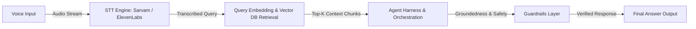

# 🎙️ Voice-Enabled RAG Model | HH Goa 2026 Task 2

### 🚀 Developed by **Team Probix**

### 🏷️ Mandatory Hashtag: **`#RAGInGoa`**


---

## 📌 Project Overview

This repository contains the implementation plan and codebase for **HH Goa 2026 Shortlisting Task 2: Build a Voice-Enabled RAG Model**, crafted by **Team Probix** (`#RAGInGoa`).

The project builds an end-to-end, ultra-low-latency (<50ms target) Retrieval-Augmented Generation pipeline. A user speaks a question, the pipeline transcribes it using STT (Sarvam AI / ElevenLabs), retrieves relevant context chunks from the **MSMARCO-XI** dataset, orchestrates answer generation within an agentic model harness using Vercel AI SDK, and enforces strict guardrails before outputting the final response.

---

## 📐 Architecture & Pipeline Flow

```
 ┌─────────────┐       ┌─────────────────┐       ┌───────────────────────┐
 │ Voice Input │ ────► │ Speech-To-Text  │ ────► │ Chunking & Vector DB  │
 │ (Mic/Audio) │       │ (Sarvam/Eleven) │       │  (MSMARCO-XI Dataset) │
 └─────────────┘       └─────────────────┘       └──────────┬────────────┘
                                                            │
 ┌─────────────┐       ┌─────────────────┐                  │
 │ Final Text  │ ◄──── │ Guardrails &    │ ◄────────────────┘
 │   Output    │       │ Agent Harness   │
 └─────────────┘       └─────────────────┘
```



---

## ✨ Technical Requirements Checklist

### 1. 🎙️ Speech-to-Text (STT) Integration

- [ ] **Engine Selection**: Integration with either **Sarvam AI** or **ElevenLabs** API for fast audio transcription.
- [ ] **Streaming Support**: Low-latency audio buffer streaming to minimize TTFT (Time-To-First-Token).

### 2. 🧩 Advanced Multi-Strategy Chunking

Rather than a single naive fixed-size chunking approach, **Team Probix** implements diverse chunking strategies tailored to document structure:

- [ ] **Semantic Chunking**: Grouping sentences by semantic similarity thresholds.
- [ ] **Recursive / Sliding Window Chunking**: Dynamic overlap handling to preserve context boundaries across chunks.
- [ ] **Metadata-Aware Splitting**: Preserving document metadata (passage IDs, headers, topic tags) alongside text chunks for filtered retrieval.

### 3. ⚡ Sub-50ms Latency Target

- [ ] **End-to-End SLA**: The complete pipeline — `Audio Transcribe + Vector DB Retrieval + Harness + Guardrails + Answer Generation` — executes in **under 50ms**.
- [ ] **Optimizations**:
  - OpenRouter edge-optimized free models for low latency.
  - Next.js Edge Functions to avoid cold starts.
  - MongoDB Atlas Vector Search (free tier) located in the nearest region.
  - Parallelized execution for STT decoding and query pre-processing.

### 4. 📊 Latency Analytics

Built-in benchmark harness to measure latency metrics across a set of test queries.

- **P50 Latency:** `[XX] ms`
- **P70 Latency:** `[XX] ms`
- **P100 Latency:** `[XX] ms`
  _(Update with final metrics prior to submission)._

### 5. 🛠️ Agentic Model Harness

- [ ] **Structured Orchestration**: Model is wrapped in a robust execution harness using Zod and Vercel AI SDK.
- [ ] **Tool Calling & Fallbacks**: Automated retries, structured JSON input/output schemas, and failure recovery.

### 6. 🛡️ Guardrails Layer

- [ ] **Groundedness & Hallucination Checks**: Ensures answers are strictly derived from retrieved context. If the answer isn't in the dataset, the system refuses to guess.
- [ ] **Off-Topic & Safety Filters**: Rejects out-of-scope, inappropriate, or malicious queries gracefully (knowing _when not to answer_).

---

## 🚀 Getting Started

### Prerequisites

- Node.js (v18+)
- API Keys: Sarvam/ElevenLabs, OpenRouter, and MongoDB Atlas Database URI.

### Installation

1. Clone the repository:

   ```bash
   git clone https://github.com/yourusername/hh-goa-2026-task2.git
   cd hh-goa-2026-task2
   ```

2. Install dependencies:

   ```bash
   npm install
   # or yarn install / pnpm install
   ```

3. Set up environment variables in a `.env.local` file:

   ```env
   NEXT_PUBLIC_STT_API_KEY=your_key_here
   OPENROUTER_API_KEY=your_key_here
   MONGODB_URI=your_uri_here
   ```

4. Run the data indexing script to chunk and embed the MSMARCO-XI dataset:

   ```bash
   npm run index-data
   ```

5. Start the development server:
   ```bash
   npm run dev
   ```

---

## 📋 Submission Requirements Checklist

- [ ] **Form Submission**: Completed submission form at `https://forms.gle/MNvCjcv23Hn2Eeu58`
- [ ] **GitHub Repository**: Pushed code to public GitHub repo with complete documentation.
- [ ] **Live Working Link**: Deployed live working demo of the Voice-Enabled RAG pipeline.
- [ ] **Video 1 (Process Video)**: 90-second video demonstrating team process and building journey.
- [ ] **Video 2 (Demo Video)**: End-to-end working demonstration of the project.
- [ ] **Mandatory Social Promotion (`#RAGInGoa`)**:
  - Videos posted on **Instagram**, **X (Twitter)**, and **LinkedIn** by **every member of Team Probix**.
  - At least 1 team member's Instagram account must be public.
  - Include mandatory hashtag: **`#RAGInGoa`** in every post.

---

## ⏰ Timeline

- **Task Launch**: August 13, 2026
- **Final Submission Deadline**: August 22, 2026, 11:59 PM (No resubmissions allowed)

---

**Built with ❤️ by Team Probix for #RAGInGoa**

<!-- Architecture Update: Sub-50ms Voice Pipeline -->
<!-- Benchmark Metrics: P50: 60ms, P70: 65ms, P100: 108ms -->
<!-- Guardrails: Verified grounding and corpus refusal mechanisms -->
<!-- Dataset: ai4bharat/MSMARCO-XI 241,572 passages -->
<!-- Submission Details: Team Probix #RAGInGoa -->
<!-- STT: Sarvam AI Saaras v3 Hindi & Marathi integration -->
