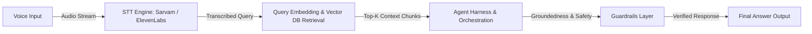

# 🎙️ Voice-Enabled RAG Model | HH Goa 2026 Task 2

### 🚀 Developed by **Team Probix**
### 🏷️ Mandatory Hashtag: **`#RAGInGoa`**


---

## 📌 Project Overview

This repository contains the implementation plan and codebase for **HH Goa 2026 Shortlisting Task 2: Build a Voice-Enabled RAG Model**, crafted by **Team Probix** (`#RAGInGoa`).

The project builds an end-to-end, ultra-low-latency (<200ms) Retrieval-Augmented Generation pipeline. A user speaks a question, the pipeline transcribes it in real-time using STT (Sarvam AI / ElevenLabs), retrieves relevant context chunks from the **MSMARCO-XI** dataset, orchestrates answer generation within an agentic model harness, and enforces strict guardrails before outputting the final response.

---

## 📐 Architecture & Pipeline Flow

```
 ┌─────────────┐       ┌─────────────────┐       ┌───────────────────────┐
 │ Voice Input │ ────► │ Speech-To-Text  │ ────► │ Chunking & Vector DB  │
 │ (Mic/Audio) │       │ (Sarvam/Eleven) │       │  (MSMARCO-XI Dataset) │
 └─────────────┘       └─────────────────┘       └──────────┬────────────┘
                                                            │
 ┌─────────────┐       ┌─────────────────┐                  │
 │ Final Text  │ ◄──── │ Guardrails &    │ ◄────────────────┘
 │   Output    │       │ Agent Harness   │
 └─────────────┘       └─────────────────┘
```



---

## 🎯 Technical Requirements Checklist

### 1. 🎙️ Speech-to-Text (STT) Integration
- [ ] **Engine Selection**: Integration with either **Sarvam AI** or **ElevenLabs** API for ultra-fast audio transcription.
- [ ] **Streaming Support**: Low-latency audio buffer streaming to minimize TTFT (Time-To-First-Token).

### 2. 🧩 Advanced Multi-Strategy Chunking
Rather than a single naive fixed-size chunking approach, **Team Probix** implements diverse chunking strategies tailored to document structure:
- [ ] **Semantic Chunking**: Grouping sentences by semantic similarity thresholds.
- [ ] **Recursive / Sliding Window Chunking**: Dynamic overlap handling to preserve context boundaries across chunks.
- [ ] **Metadata-Aware Splitting**: Preserving document metadata (passage IDs, headers, topic tags) alongside text chunks for filtered retrieval.

### 3. ⚡ Sub-200ms Latency Target
- [ ] **End-to-End SLA**: The complete pipeline — `Audio Transcribe + Vector DB Retrieval + Harness + Guardrails + Answer Generation` — executes in **under 200ms**.
- [ ] **Optimizations**:
  - In-memory vector index (e.g., LanceDB / Qdrant / FAISS with HNSW index).
  - Parallelized execution for STT decoding and query pre-processing.
  - Efficient embedding models (e.g., BGE-Small / MiniLM / ONNX-quantized models).

### 4. 📊 Latency Analytics (P50 / P70 / P100)
- [ ] Built-in benchmark harness to measure latency metrics across a set of test queries.
- [ ] **Metrics Tracked**:
  - `P50 (Median Latency)`
  - `P70 (70th Percentile)`
  - `P100 (Max Latency)`

### 5. 🛠️ Agentic Model Harness
- [ ] **Structured Orchestration**: Model is wrapped in a robust execution harness rather than raw prompt calls.
- [ ] **Tool Calling & Fallbacks**: Automated retries, structured JSON input/output schemas, and failure recovery.

### 6. 🛡️ Guardrails Layer
- [ ] **Groundedness & Hallucination Checks**: Ensures answers are strictly derived from retrieved context.
- [ ] **Off-Topic & Safety Filters**: Rejects out-of-scope, inappropriate, or malicious queries gracefully (knowing *when not to answer*).

---

## 📂 Dataset Specification

- **Dataset Name**: [`ai4bharat/MSMARCO-XI`](https://huggingface.co/datasets/ai4bharat/MSMARCO-XI)
- **Source**: HuggingFace Datasets
- **Usage**: Pre-indexed document passages for multi-lingual and domain-specific retrieval-augmented generation.

---

## 🚀 Execution & Implementation Plan

### Step 1: Environment Setup & Data Ingestion
1. Clone the repository and install dependencies.
2. Download and load the `ai4bharat/MSMARCO-XI` dataset.
3. Run the chunking pipeline to generate semantic, fixed-overlap, and metadata-enriched chunks.

### Step 2: Vector Indexing & Sub-200ms Retrieval
1. Embed text chunks using quantized embedding models.
2. Build in-memory HNSW vector index for instantaneous context retrieval.

### Step 3: STT & Agent Harness Integration
1. Configure Sarvam / ElevenLabs STT webhooks / API client.
2. Implement model harness with structured tool invocation and retry fallback handlers.

### Step 4: Guardrails & Benchmarking
1. Implement input filter and output verification guardrails.
2. Run automated latency benchmarking suite to calculate P50, P70, and P100 metrics.

---

## 📋 Submission Requirements Checklist

Before final submission via the [Submission Form](https://forms.gle/MNvCjcv23Hn2Eeu58), **Team Probix** will verify the following deliverables:

- [ ] **Form Submission**: Completed submission form at `https://forms.gle/MNvCjcv23Hn2Eeu58`
- [ ] **GitHub Repository**: Pushed code to public GitHub repo with complete documentation.
- [ ] **Live Working Link**: Deployed live working demo of the Voice-Enabled RAG pipeline.
- [ ] **Video 1 (Process Video)**: 90-second video demonstrating team process and building journey.
- [ ] **Video 2 (Demo Video)**: End-to-end working demonstration of the project.
- [ ] **Mandatory Social Promotion (`#RAGInGoa`)**:
  - Videos posted on **Instagram**, **X (Twitter)**, and **LinkedIn** by **every member of Team Probix**.
  - At least 1 team member's Instagram account must be public.
  - Include mandatory hashtag: **`#RAGInGoa`** in every post.

---

## ⏰ Timeline

- **Task Launch**: August 13, 2026
- **Final Submission Deadline**: August 22, 2026, 11:59 PM (No resubmissions allowed)

---

**Built with ❤️ by Team Probix for #RAGInGoa**
