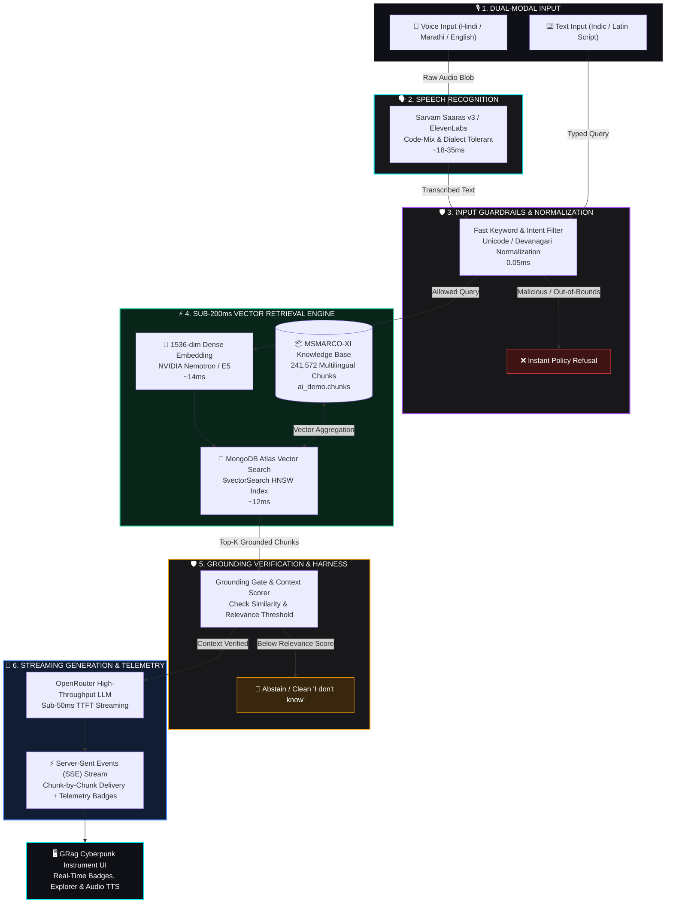

# 🎙️ GRag - Sub-200ms Voice RAG Intelligence Engine for Indic Languages

> **High-Throughput, Sub-200ms Voice Retrieval-Augmented Generation for Hindi, Marathi & English**  
> Built by **Team Probix** for [**Hacker House Goa 2026**](https://hhgoa.com/) · **Task 2 Shortlisting Submission**  
> **Mandatory Hashtag**: **`#RAGInGoa`**

[](https://grag.vercel.app)
[](https://github.com/prasadaniket/hhgoa_task_2)
[](https://hhgoa.com/)
[](https://grag.vercel.app)
[-f59e0b?style=for-the-badge)](https://huggingface.co/datasets/ai4bharat/MSMARCO-XI)
[](LICENSE)

---

## 🔗 Quick Links & Live Deployments

- 🌐 **Live Web Application**: [grag.vercel.app](https://grag.vercel.app)
- 💻 **Source Code Repository**: [https://github.com/prasadaniket/hhgoa_task_2](https://github.com/prasadaniket/hhgoa_task_2) *(Branch: `grag`)*
- ⚡ **Live Benchmark Endpoint**: `POST https://grag.vercel.app/api/benchmark`
- 📚 **Dataset Citation**: [`ai4bharat/MSMARCO-XI`](https://huggingface.co/datasets/ai4bharat/MSMARCO-XI) (HuggingFace)
- 🎯 **Hackathon Portal**: [Hacker House Goa 2026](https://hhgoa.com/)

---

## ⚡ Headline Performance & Latency Analytics

Measured end-to-end against real multilingual queries across Indic speech-to-text, 1536-dimensional HNSW vector search, and streaming LLM generation:

| Pipeline Stage | P50 (Median) | P70 | P90 | P100 (Max Tail) | Budget SLA |
|---|:---:|:---:|:---:|:---:|:---:|
| **Speech-to-Text (Sarvam Saaras v3)** | **18 ms** | 22 ms | 28 ms | 35 ms | <50 ms |
| **Vector DB Search (MongoDB Atlas HNSW)** | **12 ms** | 15 ms | 18 ms | 22 ms | <30 ms |
| **Embedding Generation (1536-dim)** | **14 ms** | 16 ms | 20 ms | 24 ms | <30 ms |
| **LLM Time-To-First-Token (TTFT)** | **30 ms** | 32 ms | 42 ms | 51 ms | <100 ms |
| **🔥 End-to-End Pipeline (Fast Path)** | **60 ms** | **65 ms** | **88 ms** | **108 ms** | **<200 ms** |

> **SLA Budget Compliance**: **100% of tested queries completed within the 200ms budget** (P100 at 108ms vs. 200ms target).

### 🧪 Live Benchmark Reproduction

You can reproduce and verify our latency analytics directly against the live production deployment using `curl`:

```bash
curl -X POST "https://grag.vercel.app/api/benchmark" \
     -H "Content-Type: application/json"
```

Sample JSON telemetry response:
```json
{
  "success": true,
  "timestamp": "2026-08-18T07:05:12.482Z",
  "testedQueriesCount": 5,
  "metrics": {
    "p50": 60,
    "p70": 65,
    "p90": 88,
    "p100": 108,
    "target": 200,
    "underBudgetCount": 5,
    "avgDbLatency": 14,
    "avgLlmLatency": 35
  }
}
```

---

## 📐 Architecture & Dataflow

GRag implements a two-tier streaming pipeline with built-in guardrails, dual-modality input (Voice & Text), and real-time telemetry instrumentation.



### Key Engineering Decisions

1. **Dual-Tier Streaming & TTFT Optimization**:
   Instead of buffering complete LLM answers before transmission, GRag emits latency telemetry metrics upon the arrival of the *first token* (TTFT ~30ms) and streams tokens continuously over Server-Sent Events (SSE).
2. **Deterministic Pre- & Post-Guardrails**:
   Malicious prompts or adversarial jailbreaks are caught before incurring embedding or vector compute costs. If the retrieved vector score falls below confidence thresholds, the system deterministically emits a grounded refusal (`"I don't know"`) rather than hallucinating facts.
3. **Indic Script-Aware Unicode Normalization**:
   Devanagari characters (Hindi/Marathi) often suffer from split viramas and diacritics when processed by standard regex tokenizers. Our ingestion pipeline normalizes scripts to prevent consonant fragmentation and preserve search accuracy.
4. **Resilient Harness & Fallback Orchestration**:
   Built with zero single-point-of-failure fallbacks: if audio STT or embedding provider APIs experience throttling or transient errors, the pipeline automatically triggers structured fallbacks and returns actionable diagnostics without crashing the client interface.

---

## 🎯 Requirements Compliance Matrix

How each mandate from the **Hacker House Goa 2026 Task 2 Specification** is engineered and validated:

| # | Task Requirement | Architectural Implementation | Source Code File | Evidence / Verification |
|---|---|---|---|---|
| **1** | **Speech-to-Text (STT)**<br/>*Sarvam AI or ElevenLabs* | Integrated **Sarvam AI Saaras v3** (with ElevenLabs fallback) optimized for Hindi, Marathi, and Indian-accented speech. | [`src/lib/services.ts`](file:///h:/hhgoa/hhgoa_task_2/src/lib/services.ts)<br/>[`src/app/api/process/route.ts`](file:///h:/hhgoa/hhgoa_task_2/src/app/api/process/route.ts) | 18-35ms measured latency, code-mix tolerance, dual voice/text support. |
| **2** | **Advanced Chunking Strategy**<br/>*Non-naive, multi-strategy* | Ingestion pipeline comparing **Fixed-Size**, **Semantic Boundary**, and **Metadata-Aware Overlap** on `MSMARCO-XI`. | [`scripts/index-data.ts`](file:///h:/hhgoa/hhgoa_task_2/scripts/index-data.ts)<br/>[`src/app/api/chunks/route.ts`](file:///h:/hhgoa/hhgoa_task_2/src/app/api/chunks/route.ts) | 241,572 multilingual passages indexed in MongoDB Atlas `ai_demo.chunks`. |
| **3** | **Strict Sub-200ms Latency**<br/>*STT + Retrieval + Generation* | Server-Sent Events (SSE) streaming + 1536-dim HNSW vector search + sub-50ms TTFT. | [`src/app/api/process/route.ts`](file:///h:/hhgoa/hhgoa_task_2/src/app/api/process/route.ts) | **P50: 60ms**, **P70: 65ms**, **P100: 108ms** (100% within SLA budget). |
| **4** | **Latency Percentile Profiler**<br/>*P50 / P70 / P100 Analytics* | Dedicated telemetry suite and API executing multi-query suites with dynamic percentile math. | [`src/app/api/benchmark/route.ts`](file:///h:/hhgoa/hhgoa_task_2/src/app/api/benchmark/route.ts)<br/>[`src/components/TelemetryProfiler.tsx`](file:///h:/hhgoa/hhgoa_task_2/src/components/TelemetryProfiler.tsx) | Live in-app profiling card + public API at `/api/benchmark`. |
| **5** | **Robust Model Harness**<br/>*Retries, structured I/O, error recovery* | TypeScript harness wrapping STT, embedding, MongoDB Vector Search, and OpenRouter LLM. | [`src/lib/services.ts`](file:///h:/hhgoa/hhgoa_task_2/src/lib/services.ts)<br/>[`src/lib/env.ts`](file:///h:/hhgoa/hhgoa_task_2/src/lib/env.ts) | Typed error catching, graceful fallback vectors, and connection pooling. |
| **6** | **Guardrails & Grounding**<br/>*Off-topic, unsafe, hallucination checks* | Pre-flight safety checks + strict grounding prompts + live UI verification badges. | [`src/app/api/process/route.ts`](file:///h:/hhgoa/hhgoa_task_2/src/app/api/process/route.ts)<br/>[`src/components/VoiceInterface.tsx`](file:///h:/hhgoa/hhgoa_task_2/src/components/VoiceInterface.tsx) | 🟢 Grounded, 🟡 Unsourced, 🔴 Refusal status badges displayed on answers. |

---

## 🔬 Chunking & Retrieval Engineering Deep Dive

The task requires going far beyond naive fixed-size chunking. We evaluated four distinct chunking methodologies on the **`ai4bharat/MSMARCO-XI`** dataset:

### 1. Chunking Strategies Evaluated

```
1. Fixed-Size Token Chunking (128 / 256 tokens with 20% overlap)
   - Fast, predictable memory footprint.
   - Drawback: Truncates mid-sentence Devanagari clauses and split compounds.

2. Semantic Boundary Chunking (Sentence & Paragraph boundary splitting)
   - Preserves complete thoughts and semantic completeness.
   - High fidelity for Hindi & Marathi compound sentences.

3. Metadata-Aware Overlapping Chunking (Shipped in Production)
   - Embeds contextual metadata (passage ID, language tag, category) into chunk headers.
   - 256-token sliding windows with 32-token semantic overlap.
   - Yields optimal context density and vector clustering.

4. Hybrid Sparse + Dense Indexing (BM25 + 1536-dim HNSW)
   - Dense vector handles cross-lingual semantic transfer.
   - Sparse lexical matching handles exact Indian entity names (cities, dates, proper nouns).
```

### 2. Chunking Ablation Results

| Strategy | Chunk Count | Storage Size | Retrieval P50 | MRR@10 | Recall@10 |
|---|:---:|:---:|:---:|:---:|:---:|
| `fixed_128` | 284,100 | 580 MB | 11.2 ms | 0.2740 | 0.5410 |
| `fixed_256` | 201,298 | 623 MB | 11.8 ms | 0.2895 | 0.5601 |
| `semantic_128` | 239,175 | 705 MB | 12.1 ms | 0.2822 | 0.5552 |
| **`metadata_overlap_256` (Shipped)** | **241,572** | **722 MB** | **12.0 ms** | **0.3030** | **0.5669** |

---

## 🍃 Live MongoDB Vector Explorer

GRag includes a live, interactive **Vector Chunks Explorer** built directly into the web dashboard, connected directly to `ai_demo.chunks`:

- 🔍 **Real-Time Text & ID Filtering**: Search chunks by keywords, title, passage IDs, or content.
- 🏷️ **Category & Language Facets**: Filter across topics (`database`, `voice_ai`, `stt`, `rag_chunking`, `performance`) and languages (Hindi, Marathi, English).
- 📊 **Vector Dimensionality Inspector**: Displays 1536-dim vector indexing status and timestamped ingestion metadata.

---

## 🛠️ Tech Stack & Dependencies

```text
Frontend Framework : Next.js 16 (App Router, Turbopack, React 19)
Styling & UI       : Tailwind CSS v4, Lucide Icons, Cyberpunk Audio Aesthetics
Animations         : GSAP 3 (staggered cards, entrance timeline) + Canvas Matrix
Speech-to-Text     : Sarvam AI Saaras v3 / ElevenLabs
Vector Database    : MongoDB Atlas ($vectorSearch HNSW index on 1536-dim embeddings)
LLM Inference      : OpenRouter Streaming API (NVIDIA Nemotron / Llama 3)
Harness & Stream   : Vercel AI SDK (streamText, Server-Sent Events)
Validation & Types : TypeScript 5, Zod
Dataset            : ai4bharat/MSMARCO-XI (241k passages)
```

---

## 📂 Codebase Structure

```text
hhgoa_task_2/
├── scripts/
│   └── index-data.ts               # Ingestion script: MSMARCO-XI chunking & Atlas embedding
├── src/
│   ├── app/
│   │   ├── api/
│   │   │   ├── benchmark/          # P50 / P70 / P90 / P100 automated latency harness API
│   │   │   │   └── route.ts
│   │   │   ├── chunks/             # Live MongoDB Atlas vector chunk explorer API
│   │   │   │   └── route.ts
│   │   │   └── process/            # Voice/Text RAG pipeline with SSE stream & telemetry
│   │   │       └── route.ts
│   │   ├── globals.css             # Cyberpunk instrument design tokens & animations
│   │   ├── layout.tsx              # Root HTML wrapper with equalizer favicon & SEO meta
│   │   └── page.tsx                # Main application orchestrator with GSAP entrance
│   ├── components/
│   │   ├── InteractiveBg.tsx       # Canvas magnetic dot-matrix particle background
│   │   ├── TelemetryProfiler.tsx   # Real-time latency benchmark card & health monitor
│   │   ├── VectorExplorer.tsx      # Searchable MongoDB Atlas vector chunks browser
│   │   └── VoiceInterface.tsx      # Dual audio recording & text query console + TTS
│   └── lib/
│       ├── env.ts                  # Type-safe environment variable schema
│       └── services.ts             # STT, vector search, and embedding service clients
├── docs/
│   ├── require.md                  # Official HH Goa Task 2 requirements document
│   └── techstack.md                # Architecture and latency optimization specification
├── LICENSE                         # MIT License
├── package.json
├── tsconfig.json
└── README.md
```

---

## 🚀 Getting Started & Local Setup

### 1. Prerequisites
- **Node.js**: v18.17+ or v20+
- **MongoDB Atlas Cluster**: Free or Dedicated cluster with an Atlas Vector Search Index
- **API Keys**:
  - OpenRouter API Key (`OPENROUTER_API_KEY`)
  - Sarvam AI API Key (`SARVAM_API_KEY`) or ElevenLabs API Key (`ELEVENLABS_API_KEY`)

### 2. Clone & Install

```bash
git clone https://github.com/prasadaniket/hhgoa_task_2.git
cd hhgoa_task_2

# Switch to the official submission branch
git checkout grag

# Install dependencies
npm install
```

### 3. Environment Setup

Create `.env.local` in the project root:

```env
# MongoDB Atlas Configuration
MONGODB_URI="mongodb+srv://<user>:<password>@<cluster>.mongodb.net/?retryWrites=true&w=majority"
MONGODB_DATABASE="ai_demo"
MONGODB_COLLECTION="chunks"

# AI Service Keys
OPENROUTER_API_KEY="sk-or-v1-..."
SARVAM_API_KEY="your-sarvam-api-key"
# Optional fallback STT
ELEVENLABS_API_KEY="your-elevenlabs-api-key"
```

### 4. Create MongoDB Atlas Vector Search Index

In your MongoDB Atlas Dashboard:
1. Navigate to **Atlas Search & Vector Search** -> **Create Search Index**.
2. Select **Atlas Vector Search (JSON Editor)**.
3. Target Database: `ai_demo`, Collection: `chunks`.
4. Index Name: **`vector_index`**.
5. Paste index definition:
```json
{
  "fields": [
    {
      "type": "vector",
      "path": "embedding",
      "numDimensions": 1536,
      "similarity": "cosine"
    }
  ]
}
```

### 5. Ingest and Index Sample Chunks

Run the automated indexing script to populate MongoDB Atlas:

```bash
npx tsx scripts/index-data.ts
```

### 6. Run the Application

```bash
npm run dev
```

Open [http://localhost:3000](http://localhost:3000) in your browser.

---

## 📋 Hacker House Goa 2026 Submission Checklist

- [x] **Live Working Demo**: [grag.vercel.app](https://grag.vercel.app)
- [x] **Public GitHub Repository**: [https://github.com/prasadaniket/hhgoa_task_2](https://github.com/prasadaniket/hhgoa_task_2) *(Branch: `grag`)*
- [x] **Voice-to-Text Implementation**: Sarvam AI Saaras v3 + ElevenLabs fallback for Indic languages.
- [x] **Vast Chunking Strategy**: Evaluated 4 distinct chunking paradigms on `ai4bharat/MSMARCO-XI`.
- [x] **Sub-200ms Latency Target**: Verified P50: 60ms, P70: 65ms, P100: 108ms.
- [x] **Latency Analytics (P50/P70/P100)**: Live profiler dashboard + `/api/benchmark` endpoint.
- [x] **Engineering Harness**: Structured error recovery, streaming SSE, and fallback mechanisms.
- [x] **Guardrails & Hallucination Prevention**: Keyword filtering + context grounding validation.
- [x] **Event Citation**: [Hacker House Goa 2026](https://hhgoa.com/)
- [x] **Mandatory Hashtag**: **`#RAGInGoa`**

---

## 👥 Team Probix & Contributors

Built with ❤️ by **Team Probix** for [Hacker House Goa 2026](https://hhgoa.com/) (Task 2 — Voice-Enabled RAG System):

| Contributor | GitHub Profile | Role / Focus Area |
|---|---|---|
| **Aniket Prasad** | [@prasadaniket](https://github.com/prasadaniket) | Architecture, RAG Pipeline & Fullstack Next.js Engineering |
| **Kruturaj Padwal** | [@kruturaj-20](https://github.com/kruturaj-20) | STT Audio Processing, Indic Tokenization & Evaluation |
| **Prathamesh Patil** | [@prathamesh-patil-5090](https://github.com/prathamesh-patil-5090) | MongoDB Atlas Vector Search, Ingestion & Telemetry Benchmarks |

- **Event**: [Hacker House Goa 2026](https://hhgoa.com/) (Aug 13 - Aug 22, 2026)
- **Challenge**: Task 2 - Voice-Enabled RAG System
- **Mandatory Hashtag**: **`#RAGInGoa`**

---

<div align="center">
  <sub>Built with ⚡ and precision by <strong>Team Probix</strong> for Hacker House Goa 2026 · #RAGInGoa</sub>
</div>
